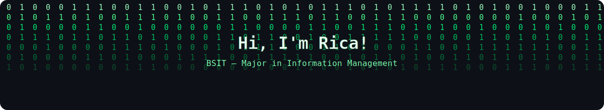
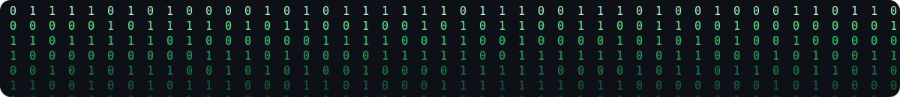

<picture>
  <source media="(prefers-color-scheme: dark)" srcset="https://readme-typing-svg.demolab.com/?lines=Currently+building+CMUTrek+%F0%9F%8C%B2;Learning+Machine+Learning%2C+one+model+at+a+time;Turning+coffee+into+clean+code;Always+down+for+a+good+debugging+story&font=Fira+Code&center=true&width=600&height=45&color=2EC4B6&vCenter=true&size=20&pause=1000">
  <source media="(prefers-color-scheme: light)" srcset="https://readme-typing-svg.demolab.com/?lines=Currently+building+CMUTrek+%F0%9F%8C%B2;Learning+Machine+Learning%2C+one+model+at+a+time;Turning+coffee+into+clean+code;Always+down+for+a+good+debugging+story&font=Fira+Code&center=true&width=600&height=45&color=FF4D6D&vCenter=true&size=20&pause=1000">
  
</picture>

 

  

 
<i>me debugging at 2am and somehow winning</i>

 

### 🧭 *Fernweh*

> **Fernweh** — my favorite word. It has no direct English translation, but it means an intense longing to travel and explore distant, unknown places — a kind of heartache for the things we haven't yet seen.
>
> Programming feels like that. There are possibilities just out of reach — entire systems we can almost understand but not quite, a horizon that keeps moving as we walk toward it. The bugs and the error logs are honest about how far we still have to go. Sometimes that truth stings. But we keep building anyway. Because somewhere ahead is something we haven't made yet. Because we hope.

 

## 🌲 About Me

Hi, I'm Rica — a BS Information Technology student at Central Mindanao University, majoring in Information Management. Which is a formal way of saying: I think in databases, dream in component trees, and I'm slowly getting better at not pushing straight to main.
Outside of that, I recharge by doing absolutely nothing — horizontal, staring at the ceiling, thoughts on airplane mode. If that stops working, I find someone to ragebait. It's a system.

I want to become someone I'll never regret becoming. I want to go to the places I've always wanted to go. Somewhere in all of that, I believe in hope — not the easy kind, but the kind that stays whether something is coming, not coming, or anywhere in between. I think the moment you lose hope, you lose the courage to begin again. And beginning again is the whole point.

Oh — and if I've already eaten something once today, it's dead to me for the rest of the day. Breakfast and lunch? That dish is retired by dinner.

- 🎓 Studying **Information Technology – Information Management** at Central Mindanao University, Bukidnon, Philippines
- 🌱 Currently expanding into **Machine Learning** and **Big Data Analytics**
- 💻 Still leveling up across the stack — frontend, backend, and database design
- ☕ Learning the ropes of code reviews and team collaboration, one PR at a time
- 🧩 Untangling messy schemas is scary, but I'm slowly getting less scared of it

## 🛠️ Tech Stack

  

 

## 📊 GitHub Stats

<picture>
  <source media="(prefers-color-scheme: dark)" srcset="https://github-readme-stats.vercel.app/api?username=kiyoko-kei&show_icons=true&hide_border=true&bg_color=0D1117&title_color=FFD23F&icon_color=2EC4B6&text_color=c9d1d9">
  <source media="(prefers-color-scheme: light)" srcset="https://github-readme-stats.vercel.app/api?username=kiyoko-kei&show_icons=true&hide_border=true&bg_color=ffffff&title_color=FF4D6D&icon_color=2EC4B6&text_color=24292f">
  
</picture>

<picture>
  <source media="(prefers-color-scheme: dark)" srcset="https://github-readme-streak-stats.herokuapp.com/?user=kiyoko-kei&hide_border=true&background=0D1117&ring=FFD23F&fire=FFD23F&currStreakLabel=2EC4B6&currStreakNum=ffffff&sideNums=ffffff&sideLabels=c9d1d9&dates=8b949e">
  <source media="(prefers-color-scheme: light)" srcset="https://github-readme-streak-stats.herokuapp.com/?user=kiyoko-kei&hide_border=true&background=ffffff&ring=FF4D6D&fire=FF4D6D&currStreakLabel=2EC4B6&currStreakNum=24292f&sideNums=24292f&sideLabels=24292f&dates=57606a">
  
</picture>

<picture>
  <source media="(prefers-color-scheme: dark)" srcset="https://github-readme-stats.vercel.app/api/top-langs/?username=kiyoko-kei&layout=compact&hide_border=true&bg_color=0D1117&title_color=FFD23F&text_color=c9d1d9">
  <source media="(prefers-color-scheme: light)" srcset="https://github-readme-stats.vercel.app/api/top-langs/?username=kiyoko-kei&layout=compact&hide_border=true&bg_color=ffffff&title_color=FF4D6D&text_color=24292f">
  
</picture>

 

## 📬 Reach Me

